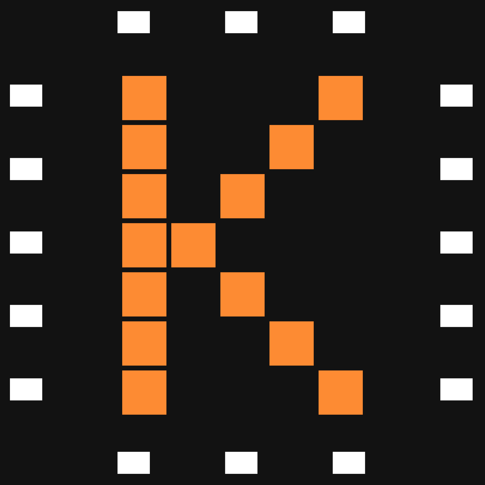

<div align="center">

 # Kairo PJS 2

**Um smart display / painel doméstico reativo, monocromático e leve o suficiente para rodar em tablets Android legados.**

Construído com [SolidJS](https://www.solidjs.com/) sobre a arquitetura [PocketJS](https://github.com) (`@pocketjs/framework`), com suporte nativo desde **Android 2.3 Gingerbread** (via QuickJS + OpenGL ES 2.0) até tablets e desktops modernos.

</div>

---

## 📸 Screenshots

> Adicione os prints do app nos espaços abaixo (salve as imagens em `docs/screenshots/` com esses nomes, ou ajuste os caminhos).

<table>
  <tr>
    <td align="center"><b>Relógio (Home)</b><br/></td>
    <td align="center"><b>Calendário</b><br/></td>
  </tr>
  <tr>
    <td align="center"><b>Notas</b><br/></td>
    <td align="center"><b>Porta-Retratos</b><br/></td>
  </tr>
  <tr>
    <td align="center"><b>Contatos</b><br/></td>
    <td align="center"><b>Configurações</b><br/></td>
  </tr>
</table>

<div align="center">
  <br/>
  <sub>Tema claro / escuro automático (adicione um print lado a lado, se quiser)</sub>
</div>

---

## Sobre o projeto

O Kairo PJS 2 funciona como um sistema operacional simplificado para uma tela sempre ligada — pense num tablet fixo na parede da cozinha ou numa moldura digital inteligente. Todas as telas navegam por um roteador reativo único, com transições suaves e um menu flutuante acionado por *swipe-up*, e o design é deliberadamente **monocromático** (preto, branco e cinza), com uma única exceção cromática: o amarelo do bloco de notas.

## ✨ Principais funcionalidades

- **Relógio com Watchfaces trocáveis** — a tela inicial exibe hora, data, previsão do tempo (via [Open-Meteo](https://open-meteo.com/)) e os próximos 7 dias da agenda. O mostrador do relógio é uma *watchface* independente: vem com 4 estilos de fábrica (Padrão, Analógico Clássico, Minimalista, Dígitos em Blocos) e novas podem ser **importadas via arquivo `.json`** seguindo o formato declarativo documentado em [`WATCHFACES.md`](./WATCHFACES.md).
- **Calendário completo** — grade mensal, criação de compromissos numa página dedicada, detalhes por dia e integração opcional com o Google Agenda (sincronização via link iCal).
- **Bloco de notas** — grade de notas em estilo *post-it*, editor em tela cheia com estética de papel pautado (*legal pad*), com alternância explícita entre modo leitura e modo edição.
- **Porta-retratos digital** — slideshow de fotos em tela cheia com relógio sobreposto, controles com auto-ocultação, velocidade configurável (incluindo um valor personalizado em segundos).
- **Contatos** — lista pesquisável com layout *Master-Detail* em tablets e sobreposição em tela cheia em celulares.
- **Configurações em abas** — Agenda, Porta-Retratos, Watchfaces e Sistema (orçamento de RAM simulado para QuickJS, escala de interface para telas de toque, status do viewport em tempo real).
- **Tema claro/escuro automático**, escala de interface ajustável e animações de transição entre todas as telas e no menu flutuante.
- **100% responsivo** — de celulares compactos a tablets em paisagem, com um único breakpoint reativo (`src/viewport.ts`) usado em todo o app.

## 🎨 Sistema de design

- **Monocromático** por regra: preto, branco e tons de cinza via variáveis CSS (`--bg-color`, `--text-color`, `--surface-color`, `--card-color`, `--border-color`), com alternância automática por `prefers-color-scheme`. A única exceção são as cores do bloco de notas.
- **Ícones [Phosphor](https://phosphoricons.com/)** desenhados como SVG puro (`src/components/Icons.tsx`), sem dependência de pacotes de ícones pesados.
- **Botões em pílula** (`border-radius: 9999px`) via a classe `.action-button`, cards com cantos de 16px, painéis grandes (relógio, clima, porta-retratos) com o componente `Squircle` (33px).
- Sem glow, sem sombras coloridas, sem gradientes vibrantes — só contraste preto/branco e opacidade.

## 🧱 Stack tecnológica

| Camada | Tecnologia |
|---|---|
| Runtime / bundler | [Bun](https://bun.sh/) + [Vite 6](https://vitejs.dev/) |
| UI reativa | [SolidJS 1.9](https://www.solidjs.com/) (sem Virtual DOM) |
| Linguagem | TypeScript 5.7 |
| Framework host | [`@pocketjs/framework`](https://www.npmjs.com/package/@pocketjs/framework) (empacotamento nativo Android + Web) |
| Ícones | Phosphor Icons (SVG inline) |
| Estilo | CSS puro com variáveis nativas e utilitários hand-rolled (sem Tailwind) |

## 📂 Estrutura do projeto

```
Kairo PJS 2/
├── index.html                   # Host HTML: tokens de tema, utilitários CSS, fontes
├── pocket.json                  # Manifesto de janela e alvos nativos do PocketJS
├── package.json                 # Dependências e scripts
├── WATCHFACES.md                # Especificação do formato de watchface (.json)
└── src/
    ├── index.tsx                # Ponto de entrada
    ├── router.tsx                # Roteador reativo, swipe-up, transições entre telas
    ├── types.ts                  # Tipos de domínio (eventos, notas, contatos, watchfaces...)
    ├── viewport.ts                # Breakpoint reativo (isTablet) e escala de UI
    ├── calendarStore.ts           # Eventos do calendário + persistência
    ├── contactsStore.ts           # Contatos + busca + formatação de telefone
    ├── notesStore.ts              # Notas + persistência
    ├── photosStore.ts             # Slideshow de fotos + diretório + intervalo
    ├── watchfaceStore.ts          # Watchfaces (fábrica + customizadas), import/validação
    ├── services/
    │   └── googleCalendar.ts      # Parser iCal e integração com Google Calendar API v3
    ├── components/
    │   ├── Button.tsx / Card.tsx / Squircle.tsx
    │   ├── FloatingNav.tsx        # Menu flutuante com animação de abertura/fechamento
    │   ├── Icons.tsx               # Biblioteca de ícones Phosphor em SVG puro
    │   ├── StatusBar.tsx
    │   ├── Watchface.tsx           # Intérprete do formato de watchface
    │   └── WatchfacePreview.tsx    # Miniatura ao vivo usada no seletor de watchfaces
    └── pages/
        ├── ClockHome.tsx           # Relógio (watchface) + clima + próximos eventos
        ├── Calendar.tsx            # Grade mensal
        ├── DayDetails.tsx          # Compromissos de um dia
        ├── NewEvent.tsx            # Formulário de novo compromisso
        ├── Notes.tsx               # Bloco de notas
        ├── Contacts.tsx            # Contatos
        ├── PhotoFrame.tsx          # Porta-retratos digital
        └── Settings.tsx            # Configurações em abas
```

## 🚀 Como rodar

```bash
# instalar dependências
bun install

# ambiente de desenvolvimento
bun run dev

# checagem de tipos
bun run typecheck

# build de produção
bun run build

# pré-visualizar o build de produção
bun run preview
```

## 📱 Empacotamento Android (PocketJS)

O `pocket.json` descreve a janela e os alvos de build nativo. Para tablets Android físicos (incluindo hardware legado em Android 2.3 Gingerbread), o PocketJS compila o núcleo em Rust + QuickJS para `armv7-linux-androideabi`, renderizando via `NativeActivity` + OpenGL ES 2.0 — sem depender do navegador do sistema.

## 🖼️ Criando sua própria Watchface

Novas watchfaces são instaladas em **Configurações → Watchfaces → Importar Watchface**, a partir de um arquivo `.json`. O formato completo (tipos de elemento, tokens de hora, exemplo anotado) está documentado em [`WATCHFACES.md`](./WATCHFACES.md).

## 📄 Licença

_A definir._
